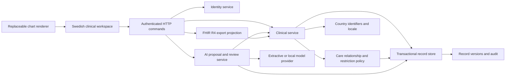

# Architecture

Decision baseline: 2026-09-18. Scope: Swedish ambulatory primary care first; country-specific deployments across the EU later.

## Clinical System And Exchange Network

Eir owns the local workflow, record integrity, and attribution. National exchange networks are external participants with their own identity, authorization, semantics and onboarding. A nationwide access portal does not replace a clinician's order, result, follow-up and correction workflows. Learn from Estonia's cross-provider access and Denmark's governed message contracts while building a complete practice system.

The clinical record is canonical locally. FHIR is a versioned projection at the boundary. There is no dual-write openEHR/FHIR database: that would create two sources of truth without an established reconciliation protocol. Evaluate HAPI FHIR/Medplum for a full FHIR service and EHRbase for template-based longitudinal storage during the interoperability milestone. Adopt an existing implementation where its capabilities and license fit; do not implement AQL or a complete FHIR validator from scratch.

## Implemented Plugin Model

Each plugin declares `id`, semantic `version`, `apiVersion`, `provides`, `requires` and `setup`. The runtime resolves dependencies, rejects duplicate providers and cycles, exposes only declared service dependencies, and disposes effects in reverse order on failure or shutdown. Replacing a provider is a profile edit and controlled restart. There is deliberately no live database-provider swap during an encounter.

The shared interfaces in `packages/contracts.ts` are the contract. Domain plugins do not issue SQL. The SQLite plugin implements persistence, session storage, relationship storage and the audit primitives. The browser chart consumes authorized record snapshots through a `render(target, records)` contract. Both supplied renderers run against the same records and backend permissions.

**Trust model:** server plugins and UI bundles are reviewed code installed by the operator. They run with application privileges. Dependency declaration is a programming contract, not a sandbox; an in-process JavaScript module can import filesystem or network APIs. A malicious replacement policy or storage plugin can violate guarantees. Multi-vendor untrusted extensions require a separate process/container, a restricted API principal, explicit patient scope and controlled egress. The runtime does not pretend otherwise.

## Record Model And Transactions

Every entity has tenant, patient ID, kind, revision, timestamps and a validated payload. The API accepts clinical commands, not arbitrary JSON resource writes. Reference checks require an open encounter belonging to the same patient. Each patient has at most one open encounter in this release. The complete command and its version/audit inserts commit or roll back together. Reads append authorization decisions before returning data.

Draft notes can be revised with an expected version. Signing persists actor and time. Database triggers reject all subsequent updates to signed notes. An amendment is a new draft with a reference and reason; the original remains unchanged. A finished encounter rejects new ordinary notes; amendments remain possible. Corrections to observations, diagnoses and allergies retain previous versions as `entered-in-error`. Patient/proxy views omit proposals and unsigned note versions.

No deletion endpoint exists. Erasure, identity merge/unmerge, legal retention, legal hold and migration require designed workflows rather than bypassing the audit trail. The version log also supplies a cursor-based change feed. Consumers must deduplicate by entity ID plus version, store cursors, and re-authorize each poll.

Runtime API v2 uses asynchronous unit-of-work contracts across storage and stateful services. SQLite serializes awaited work on its local connection; PostgreSQL uses independent clients, serializable transactions, role-bound RLS and a separately operated migration ledger. Both providers preserve version and audit atomicity. This is an explicit breaking plugin contract change, not a silent drop-in adapter. See [PERSISTENCE.md](PERSISTENCE.md) for boundaries, staging and recovery.

## AI Native Workflow

The common clinical command API is used by both humans and AI review. Evidence snapshots contain record IDs and versions. The AI provider receives a bounded copy of the authorized encounter context. Returned text, provenance and evidence are stored as a proposal. The source quotation validator rejects invented references and quotes. Acceptance rechecks permission, encounter status and all evidence revisions, then creates an ordinary draft note. Signing is a separate clinician action.

The default provider deterministically extracts source text. The alternative Ollama provider calls the real local `/api/chat` endpoint with structured output and a timeout. Models never receive a signing, prescribing, shell or direct SQL tool through this interface. Clinical text is treated as untrusted input. A model can still produce misleading text with real citations; human review and model-specific evaluations remain necessary.

Next AI capabilities should share this proposal/review mechanism: ambient documentation, coding candidates, referral preparation, longitudinal summaries and result inbox prioritization. Each needs a distinct intended use, input permissions, evaluation corpus, abstention behavior, and release gate. Clinical decision support and autonomous actions require separate assessment.

## UX Contract

Patient identity remains visible through every chart view. The workflow is register, open encounter, capture facts, draft, review, sign, follow up, close. An allergy absence is displayed as unknown, never as confirmed absence. Notes display draft/signed states and attribution. Conflicts surface as reload-required errors without overwriting a newer version. The browser stores no records or bearer tokens in localStorage.

The current UI uses Swedish labels, responsive unframed sections, keyboard-accessible native controls, two interchangeable chart views, explicit empty/error states and reduced-motion support. Patient/proxy read modes are supported by the same underlying API. A dedicated citizen portal with audit viewing, delegated access management, accessibility testing, record restrictions and correction requests is a later product milestone.

Before a clinical pilot, validate workflows with GPs, nurses, reception staff and patients, including protected identities, duplicate identities, uncertain identifiers, late results, interrupted sessions, and handoffs between staff. Test task completion and omission rates, not aesthetic preference alone.
